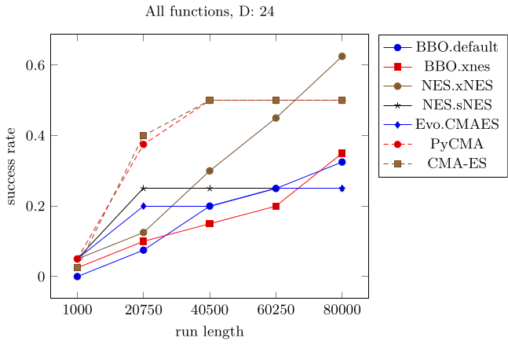
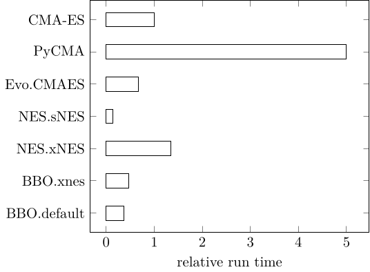

# CMAEvolutionStrategy.jl

<!--
-->
<!--


 -->
[](https://travis-ci.com/jbrea/CMAEvolutionStrategy.jl)
[](http://codecov.io/github/jbrea/CMAEvolutionStrategy.jl?branch=master)
<!--[](https://jbrea.github.io/CMAEvolutionStrategy.jl/stable)
[](https://jbrea.github.io/CMAEvolutionStrategy.jl/dev)
-->

The CMA Evolution Strategy is a stochastic method for derivative-free
optimization of potentially non-linear, non-convex or noisy functions over
continuous domains ([Hansen 2016](https://arxiv.org/abs/1604.00772)).
A brief discussion of its performance in practice can be found on
[wikipedia](https://en.wikipedia.org/wiki/CMA-ES#Performance_in_practice).

The default settings and implementation details follow closely
[Hansen 2016](https://arxiv.org/abs/1604.00772) and
[pycma](https://github.com/CMA-ES/pycma).

For details on noise handling see [Hansen 2009](http://dx.doi.org/10.1109/TEVC.2008.924423).

## Example
```julia
julia> function rosenbrock(x)
           n = length(x)
           sum(100 * (x[2i-1]^2 - x[2i])^2 + (x[2i-1] - 1)^2 for i in 1:div(n, 2))
       end

julia> using CMAEvolutionStrategy

julia> result = minimize(rosenbrock, zeros(6), 1.)
(4_w,9)-aCMA-ES (mu_w=2.8,w_1=49%) in dimension 6 (seed=17743412058849885570, 2020-05-12T16:22:27.211)
  iter   fevals   function value      sigma   time[s]
     1        9   6.06282462e+02   8.36e-01     0.008
     2       18   6.00709117e+02   8.42e-01     0.009
     3       27   2.40853796e+02   7.84e-01     0.009
   100      900   8.25748973e-01   1.44e-01     0.021
   200     1800   2.21358637e-05   1.12e-02     0.040
   266     2394   5.58767672e-12   2.76e-05     0.051
Optimizer{Parameters,BasicLogger,Stop}
(4_w,9)-aCMA-ES (mu_w=2.8,w_1=49%) in dimension 6 (seed=17743412058849885570, 2020-05-12T16:22:27.254)
  termination reason: ftol = 1.0e-11 (2020-05-12T16:22:27.255)
  lowest observed function value: 1.076905008476142e-12 at [0.9999990479016964, 0.9999981609497738, 0.9999990365312236, 0.9999981369588251, 0.9999994689450983, 0.9999988356249463]
  population mean: [1.000000255106133, 1.0000004709845969, 1.0000006232562606, 1.0000012290059055, 0.9999998790530266, 0.9999997338544545]

julia> xbest(result)
6-element Array{Float64,1}:
 0.9999990479016964
 0.9999981609497738
 0.9999990365312236
 0.9999981369588251
 0.9999994689450983
 0.9999988356249463

julia> fbest(result)
1.076905008476142e-12

julia> population_mean(result)
6-element Array{Float64,1}:
 1.000000255106133
 1.0000004709845969
 1.0000006232562606
 1.0000012290059055
 0.9999998790530266
 0.9999997338544545

help?> minimize
search: minimize

  minimize(f, x0, s0;
           lower = nothing,
           upper = nothing,
           constraints = _constraints(lower, upper),
           noisy = false,
           noise_handling = noisy ? NoiseHandling(length(x0)) : nothing,
           popsize = 4 + floor(Int, 3*log(length(x0))),
           callback = (object, inputs, function_values, ranks) -> nothing,
           parallel_evaluation = false,
           multi_threading = false,
           verbosity = 1,
           seed = rand(UInt),
           logger = BasicLogger(x0, verbosity = verbosity, callback = callback),
           maxtime = nothing,
           maxiter = nothing,
           maxfevals = nothing,
           stagnation = 100 + 100 * length(x0)^1.5/popsize,
           ftarget = nothing,
           xtol = nothing,
           ftol = 1e-11)

  Minimize function f starting around x0 with initial covariance s0 * I under box constraints
  lower .<= x0 .<= upper, where x0, lower and upper are vectors of the same length or
  nothing.

  The result is an Optimizer object from which e.g. xbest, fbest or population_mean can be
  extracted.

  If parallel_evaluation = true, the objective function f receives matrices of n rows (n =
  length(x0)) and popsize columns and should return a vector of length popsize. To use
  multi-threaded parallel evaluation of the objective function, set multi_threading = true
  and start julia with multiple threads (c.f. julia manual for the multi-threading
  setup).
```
## Benchmarks

Running
[BlackBoxOptimizationBenchmarking](https://github.com/jonathanBieler/BlackBoxOptimizationBenchmarking.jl)
in [24 dimensions](test/bbob.jl), highlights the advantage of CMA-ES early in optimization.
All methods were chained into NelderMead after 90% of the run length (c.f. [BlackBoxOptimizationBenchmarking](https://github.com/jonathanBieler/BlackBoxOptimizationBenchmarking.jl))



CMAES = this package,
BBO = [BlackBoxOptim](https://github.com/robertfeldt/BlackBoxOptim.jl),
NES = [NaturalES](https://github.com/francescoalemanno/NaturalES.jl),
Evo = [Evolutionary](https://github.com/wildart/Evolutionary.jl),
PyCMA = [pycma](https://github.com/CMA-ES/pycma)


